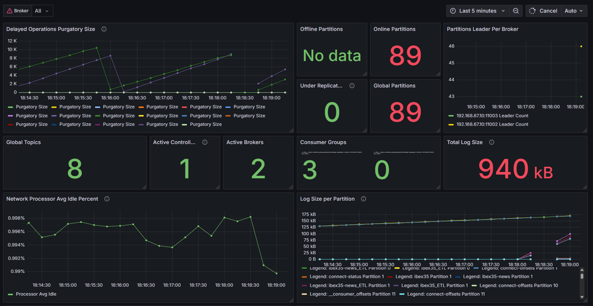

# Big Data Aplicado
## Proyecto Final

> Como proyecto final y para la evaluación del aprendizaje de todos los RAs del módulo, el alumnado realizara un proyecto completo que incluya la demostración de todo el Stack y los RAs del módulo, siguiente los requisitos que se expondrán a continuación

> La evaluación de este proyecto equivale a lo que sería el examen final del módulo.

> Desde el Departamento se darán los medios que estén a su alcance para dar soporte al proyecto.

## Índice
1. [Requisitos](#1-requisitos)
2. [Objetivo y descripción del proyecto](#2-objetivo-y-descripción-del-proyecto)

   2.1  [Fuente de datos](#21-fuente-de-los-datos)

   2.2  [Arquitectura](#22-arquitectura)

   2.3  [Visualización](#23-visualización)

   2.4  [Monitorización](#24-monitorización)

3. [Autora](#3-autora)

## 1. Requisitos

1. El proyecto deberá tener todo el stack de todos los sistemas vistos en clase perfectamente instalado, configurado y funcionando como un Sistema completo de Big Data, desde la ingesta de datos, ETL, BI y su visualización.
2. El alumnado elegirá el origen, los tipos y la temática de los datos que se van a procesar en el Sistema Big Data.
3. Deben establecer, desarrollar y justificar el tipo de conocimiento que van a obtener de los datos origen después de su ingesta y procesamiento (ETL) en el sistema. 
4. El procesamiento de los datos lo realizarán a través de SPARK, utilizando alguna de sus 3 APIs disponibles. Esto no quita que puedan realizar algún tipo de procesamiento de datos anteriormente, como por ejemplo en Kafka.
5. El sistema debe poder soportar la ingesta de datos tanto en batch como en streaming.
6. Los datos de origen podrán ser sintéticos, reales o una combinación de ambos.
7. Puedes usar las Api/s que creas necesaria/s. Incluso la creación de tus propios datos sintéticos en batch y streaming (Estos deben cumplir con los requisitos del puntos 1 al 3)
8. Todo el ETL realizado deberá estar correctamente desarrollado y justificado.
9. Se deberá añadir al stack algún sistema, servicio, ... de investigación propia (al menos 1, aunque puede añadir todos los que quieras). Se propone una lista de ellos, que podrán ser ampliados a propuesta del alumnado:
   1. AWS GLUE
   2. AWS S3
   3. Nifi
   4. Flink
   5. Tableau
   6. PowerBI
   7. Elasticsearch
   8. Kibana
   9.  RabbitMQ
   10. Otros (deben ser consensuados y aprobados)

### Requisitos comunes

1. El sistema completo será, como mínimo (más la investigación propia):
   1. Apache Hadoop Common
   2. HDFS
   3. MapReduce
   4. Yarn
   5. Spark
   6. Kafka
   7. Grafana
2. Debe haber como mínimo 3 nodos en los clusters (en cada uno):
   1. Hadoop (HDFS/Yarn)
   2. Spark
   3. Kafka

[:arrow_up:](#creación-de-microservicios-y-una-canalización-de-cicd-con-aws)

## 2. Objetivo y descripción del proyecto

El proyecto tiene como objetivo la creación de un sistema completo de Big Data destinado a monitorizar, procesar y analizar en tiempo real la evolución diaria del índice bursátil IBEX 35.

Este análisis se complementará con el procesamiento de noticias económicas relevantes. A través de la correlación entre estos dos tipos de datos —cotizaciones bursátiles y contenido de noticias económicas con scoring de sentimiento—, se busca generar insights precisos que contribuyan a una mejor toma de decisiones en la compra de acciones de las empresas que componen este índice.

[:arrow_up:](#creación-de-microservicios-y-una-canalización-de-cicd-con-aws)

### 2.1 Fuente de los datos

Para simular un entorno realista y controlado, el sistema se desarrollará utilizando datos sintéticos. Por un lado, se generarán cotizaciones por segundo de las 35 empresas que conforman el IBEX 35, simulando un flujo constante de datos bursátiles en tiempo real y por otro lado, se producirán noticias económicas sintéticas con un sistema de puntuación (scoring) de sentimiento, el cual asignará valores positivos, negativos o neutros a cada noticia, en función del tono y contenido del mensaje. Ambos flujos de datos se diseñarán en formato de streaming, permitiendo su procesamiento continuo en tiempo real.

| Fuente | Tipo de dato | Frecuencia |
| ------ | ------------ | ---------- |
| Datos sintéticos | Cotizaciones diarias de las 35 empresas del IBEX 35 por segundo | Streaming |
| Datos sintéticos | Noticias económicas o relevantes para las empresas con scoring | Streaming |

[:arrow_up:](#creación-de-microservicios-y-una-canalización-de-cicd-con-aws)

### 2.2 Arquitectura

Inicialmente, los datos generados se publican en Apache Kafka, utilizando "topics" diferenciados para cotizaciones (ibex35) y noticias (ibex35-news). Estos mensajes son consumidos en tiempo real por Apache Spark Structured Streaming, donde los datos se deserializan y se transforman: se ajustan los formatos de timestamp, se validan los campos clave, y se reempaquetan con un esquema Avro compatible. Una vez procesados, los datos transformados se publican de nuevo en Kafka, esta vez en los "topics" ibex35_ETL y ibex35-news_ETL.

Desde estos "topics" finales, Kafka Connect actúa como puente hacia las plataformas de almacenamiento persistente. En este entorno de desarrollo, pequeño y controlado, se opta por utilizar una base de datos PostgreSQL como solución de persistencia estructurada, permitiendo así una explotación sencilla mediante consultas SQL y facilitando la creación de dashboards dinámicos a través de Grafana. Esta elección resulta adecuada por su simplicidad de integración y su bajo coste operativo en entornos limitados.

Sin embargo, en un escenario real de Big Data, el uso exclusivo de PostgreSQL podría representar una limitación significativa en cuanto a escalabilidad y rendimiento, especialmente debido al alto volumen y velocidad de los datos generados. Por esta razón, se complementa el almacenamiento con HDFS (Hadoop Distributed File System), diseñado específicamente para manejar grandes volúmenes de datos de manera distribuida y eficiente. Esta solución permite conservar historiales extensos y soporta análisis batch, modelos de aprendizaje automático o minería de datos avanzada. Los datos almacenados en HDFS también se pueden visualizar a través de Power Bi de manera sencilla.

[:arrow_up:](#creación-de-microservicios-y-una-canalización-de-cicd-con-aws)

### 2.3 Visualización

Por último, la visualización de los datos analíticos se lleva a cabo mediante Grafana y Power BI. Grafana se conecta directamente a PostgreSQL donde guardamos nuestros datos en sus respectivas tablas y permite construir dashboards en tiempo real que muestran la evolución de los puntos del IBEX 35, los movimientos por empresa y los valores de scoring de las noticias relacionadas. 

Power BI, por su parte, ofrece una interfaz más enfocada en la creación de informes interactivos, con visualizaciones personalizables que permiten filtrar datos por empresa, periodo o categoría de noticia, y así facilitar el análisis de correlaciones y tendencias significativas y lo usamos con los datos guardados en HDFS, aunque en este caso los datos no podrán ser actualizados en tiempo real.

[:arrow_up:](#creación-de-microservicios-y-una-canalización-de-cicd-con-aws)

### 2.4 Monitorización

En cuanto a la monitorización del sistema, se emplea un stack compuesto por Prometheus y Grafana. Prometheus recopila métricas de Kafka ya que por tiempo no se ha podido recopilar las de Spark, como tiempos de procesamiento, rendimiento, uso de recursos o errores. Estas métricas se visualizan a través del panel en Grafana, lo cual nos permite supervisar el estado y rendimiento del sistema en tiempo real.

[:arrow_up:](#creación-de-microservicios-y-una-canalización-de-cicd-con-aws)

## 3. Autora

Guadalupe Luna Velázquez
